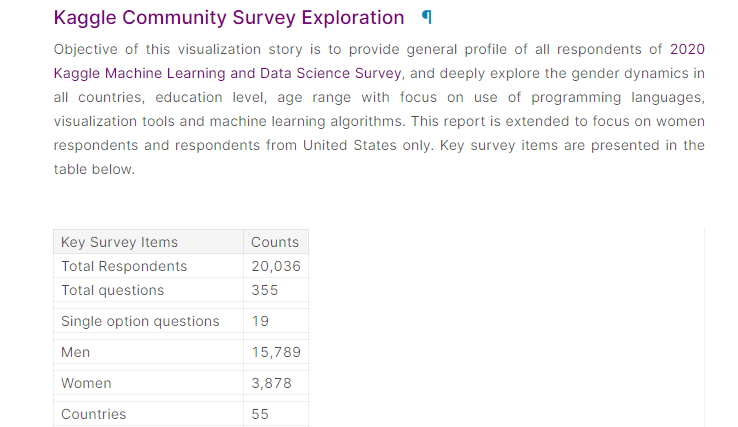
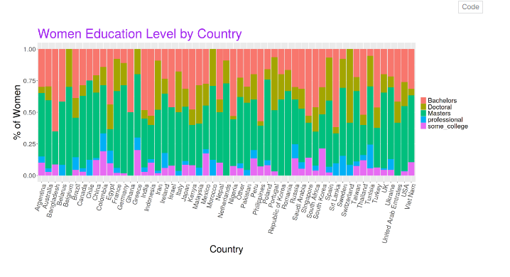

# This is a submission of Kaggle Machine Learning Survey challenge 2020

## Objective 

## Graph of age group by country

## Graph of popular Programming Languages

## Correlation of programming languages with education Level

## Women around world in Kaggle with Education Level

